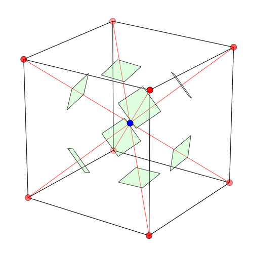

<!-- AUTO-GENERATED FILE. DO NOT EDIT. -->

# Editorial for Intra-IUT Junior Programming Contest 2026

**Date:** 2026-05-20

**Contest:** https://codeforces.com/gym/106539

## Contributors

| Name | Role |
|------|------|
| [Reaz Hassan Joarder](https://codeforces.com/profile/ssshanto) | Problem Setter |
| [Syed Rifat Raiyan](https://codeforces.com/profile/Starscream-11813) | Problem Setter |
| [Irfanur Rahman Rafio](https://codeforces.com/profile/rafio) | Problem Setter |
| [Nayeem Hossain](https://codeforces.com/profile/flying_saucer) | Problem Setter |
| [Saom bin Khaled](https://codeforces.com/profile/greenbinjack) | Problem Setter |
| [Wasi ul Habib](https://codeforces.com/profile/CodingPariNaa) | Problem Setter |
| [Jannatul Fardus Rakhi](https://codeforces.com/profile/sectumsemprra) | Problem Setter |
| [Fariya Ahmed](https://codeforces.com/profile/nazyalensky) | Problem Setter |
| [Mahiul Kabir](https://www.linkedin.com/in/mahiulkabir/) | Problem Setter |
| [Mishkat Ahmed Khan](https://codeforces.com/profile/C01d) | Problem Setter |

## Problems

| Problem ID | Problem Title |
|------------|---------------|
| A | [Glorious Batch-24!](#problem-a) |
| B | [XORnacci](#problem-b) |
| C | [Strong Password](#problem-c) |
| D | [Glass Bridge](#problem-d) |
| E | [AutoCAD Mayhem](#problem-e) |
| F | [Still a Group Project??](#problem-f) |
| G | [Moushi Is In Trouble](#problem-g) |
| H | [Unf-AI-r Task](#problem-h) |
| I | [Iris Out](#problem-i) |
| J | [The Grand Fleet's Logbook](#problem-j) |
| K | [Power of Friendship](#problem-k) |

---

# Tutorials

<a id="problem-a"></a>

<details>
<summary><strong>A. Glorious Batch-24!</strong></summary>

Problem Setter: [Fariya Ahmed](https://codeforces.com/profile/fariyapracticekorena)

Estimated Difficulty: 900

Tag(s): Number Theory

<details>
<summary>Hint 1</summary>

Rewrite $x^2 - 1$ as $(x - 1)(x + 1)$.

</details>

<details>
<summary>Hint 2</summary>

Since $24 = 8 \times 3$, analyze divisibility by $8$ and $3$ separately.

</details>

<details>
<summary>Solution</summary>

An ID $x$ is an impostor if $x^2 - 1$ is divisible by $24$.

Since $24 = 8 \times 3$, we need $x^2 - 1$ to be divisible by both $8$ and $3$. Now,

$x^2 - 1 = (x - 1)(x + 1)$.

---

First, consider divisibility by $3$.

The numbers $x - 1$, $x$, and $x + 1$ are three consecutive integers. Among any three consecutive integers, exactly one is divisible by $3$.

If $x$ itself is divisible by $3$, then neither $x - 1$ nor $x + 1$ is divisible by $3$. So $(x - 1)(x + 1)$ is not divisible by $3$.

If $x$ is not divisible by $3$, then one of $x - 1$ and $x + 1$ must be divisible by $3$. So $(x - 1)(x + 1)$ is divisible by $3$.

Therefore, $x^2 - 1$ is divisible by $3$ if and only if $x$ is not divisible by $3$.

---

Now, consider divisibility by $8 = 2^3$.

If $x$ is even, then both $x - 1$ and $x + 1$ are odd. Their product is odd, so it is not even divisible by $2$.

If $x$ is odd, then both $x - 1$ and $x + 1$ are even. They are two consecutive even numbers, so one of them must be divisible by $4$. Their product is therefore divisible by $2 \times 4 = 8$.

Therefore, $x^2 - 1$ is divisible by $8$ if and only if $x$ is odd.

---

Combining the two observations, $x^2 - 1$ is divisible by $24$ if and only if $x$ is divisible by neither $2$ nor $3$.

So the problem reduces to counting how many integers in the range $[1, N]$ are not divisible by $2$ and not divisible by $3$. You can solve this using the **inclusion-exclusion principle**.

---

Initially, consider all $N$ integers from $1$ to $N$ as possible impostor IDs.

Now, remove the integers that are divisible by $2$, because they cannot be impostors. There are $\lfloor N / 2 \rfloor$ such integers.

Then, remove the integers that are divisible by $3$, because they also cannot be impostors. There are $\lfloor N / 3 \rfloor$ such integers.

However, integers divisible by both $2$ and $3$ have now been removed twice. These are exactly the integers divisible by $6$, and there are $\lfloor N / 6 \rfloor$ of them. So, add them back once.

Thus, the final answer is $N - \lfloor N / 2 \rfloor - \lfloor N / 3 \rfloor + \lfloor N / 6 \rfloor$.

<details>
<summary>Code</summary>

```cpp
#include <bits/stdc++.h>
using namespace std;

#define fastio ios_base::sync_with_stdio(0); cin.tie(0)
using LL = long long;

void pre()
{
    fastio;
}

void solve(int tc)
{
    LL N;
    cin >> N;

    cout << N - N / 2 - N / 3 + N / 6;
}

int main()
{
    pre();

    int tc, tt = 1;
    cin >> tt;

    for(tc = 1; tc <= tt; tc++)
    {
        // cout << "Case " << tc << ": ";
        solve(tc);
        cout << '\n';
    }

    return 0;
}
```

</details>
</details>

<details>
<summary>Hint 3</summary>

Check which IDs from $1$ to $24$ are impostors. What happens to the pattern after every $24$ IDs?

</details>

<details>
<summary>Alternate Solution</summary>

Another way to solve the problem is to use the periodic nature of remainders modulo $24$.

The value of $x^2 - 1$ modulo $24$ depends only on $x$ modulo $24$. So, if an ID $x$ is an impostor, then $x + 24$ is also an impostor. Similarly, if $x > 24$, then $x$ is an impostor if and only if $x - 24$ is an impostor.

Here is a simplified proof: Since $x + 24 \equiv x \pmod {24}$, we also have $(x + 24)^2 \equiv x^2 \pmod {24}$. Subtracting $1$ from both sides gives $(x + 24)^2 - 1 \equiv x^2 - 1 \pmod {24}$. Therefore, $x^2 - 1$ is divisible by $24$ if and only if $(x + 24)^2 - 1$ is divisible by $24$.

Therefore, the pattern of impostor IDs repeats every $24$ numbers.

---

Since $24$ is small, you can first check all IDs from $1$ to $24$ and mark which remainders are impostors. Then split the range $[1, N]$ into full blocks of length $24$ and one remaining suffix.

Let $g = \lfloor N / 24 \rfloor$. If there are $k$ impostors in the first block from $1$ to $24$, then there are $g \times k$ impostors in the first $24g$ IDs.

After that, only the IDs from $24g + 1$ to $N$ remain. There are at most $23$ of them, so you can check them one by one.

<details>
<summary>Code</summary>

```cpp
#include <bits/stdc++.h>
using namespace std;

#define fastio ios_base::sync_with_stdio(0); cin.tie(0)
using LL = long long;

void pre()
{
    fastio;
}

void solve(int tc)
{
    LL N, i;
    cin >> N;

    vector<int> isImpostor(25, 0);
    int k = 0;

    for(i = 1; i <= 24; i++)
    {
        if(((i * i - 1) % 24) == 0)
        {
            isImpostor[i % 24] = 1;
            k++;
        }
    }

    LL g = N / 24;
    LL ans = g * k;

    for(i = 24 * g + 1; i <= N; i++) if(isImpostor[i % 24]) ans++;

    cout << ans;
}

int main()
{
    pre();

    int tc, tt = 1;
    cin >> tt;

    for(tc = 1; tc <= tt; tc++)
    {
        // cout << "Case " << tc << ": ";
        solve(tc);
        cout << '\n';
    }

    return 0;
}
```

</details>
</details>

</details>

<a id="problem-b"></a>

<details>
<summary><strong>B. XORnacci</strong></summary>

Problem Setter: [Jannatul Fardus Rakhi](https://codeforces.com/profile/sectumsemprra)

Estimated Difficulty: 1200

Tag(s): Bitmasks

<details>
<summary>Hint</summary>
Use these properties of XOR:

- $a \oplus b = b \oplus a $
- $a \oplus 0 = a$
- $a \oplus a = 0$
</details>

<details>
<summary>Solution</summary>

The sequence is extended using the rule $a_i = a_{i-2} \oplus a_{i-1}$ for $i > m$. Let’s check the first few terms after the given elements:

- $a_{m+1} = a_{m-1} \oplus a_m$
- $a_{m+2} = a_m \oplus a_{m+1} = a_m \oplus (a_{m-1} \oplus a_m) = a_{m-1}$
- $a_{m+3} = a_{m+1} \oplus a_{m+2} = (a_{m-1} \oplus a_m) \oplus a_{m-1} = a_m$
- $a_{m+4} = a_{m+2} \oplus a_{m+3} = a_{m-1} \oplus a_m$

We can observe that from index $m-1$ onward, the sequence repeats with period $3$. So the entire sequence is:  
$\displaystyle a_1, \dots, a_{m-2}, \underbrace{a_{m-1},\ a_m,\ (a_{m-1}\oplus a_m),\ a_{m-1},\ a_m,\ (a_{m-1}\oplus a_m),\ \dots}_{\text{period }3}$

Let a complete block be three consecutive elements of the repeating portion of the sequence. The XOR of one full block is $a_{m-1}\oplus a_m\oplus(a_{m-1}\oplus a_m)=0$.

Therefore, every complete block contributes nothing to the total XOR sum, and we only need to consider the first $m-2$ elements and the final incomplete block.

The repeating section runs from index $m-1$ through $n$, so it contains $K=n-m+2$ elements. Let $R=K \bmod 3$. This is the size of the final incomplete block.

- If $R = 0$: all elements form complete blocks, so they cancel out. The final answer is the XOR of the first $m-2$ elements:  
  $\displaystyle \bigoplus_{i=1}^{m-2} a_i$

  

- If $R = 1$: one extra element $a_{m-1}$ remains. The final answer is  
  $\displaystyle \left(\bigoplus_{i=1}^{m-2} a_i\right)\oplus a_{m-1}=\bigoplus_{i=1}^{m-1} a_i$

  

- If $R = 2$: two extra elements $a_{m-1}$ and $a_m$ remain. The final answer is  
  $\displaystyle \left(\bigoplus_{i=1}^{m-2} a_i\right)\oplus a_{m-1}\oplus a_m=\bigoplus_{i=1}^{m} a_i$

  

<details>
<summary>Code</summary>

```cpp
#include <bits/stdc++.h>
using namespace std;

#define fastio ios_base::sync_with_stdio(0); cin.tie(0)
using LL = long long;

void pre()
{
    fastio;
}

void solve(int tc)
{
    int i, n, m;
    cin >> n >> m;

    vector<int> v(m + 1);
    for(i = 1; i <= m; i++) cin >> v[i];

    vector<int> prefXor(m + 1);
    prefXor[0] = 0;
    for(i = 1; i <= m; i++) prefXor[i] = prefXor[i - 1] ^ v[i];

    int K = n - m + 2;
    int R = K % 3;

    if(R == 0) cout << prefXor[m - 2];
    else if(R == 1) cout << prefXor[m - 1];
    else cout << prefXor[m];
}

int main()
{
    pre();

    int tc, tt = 1;
    cin >> tt;

    for(tc = 1; tc <= tt; tc++)
    {
        // cout << "Case " << tc << ": ";
        solve(tc);
        cout << '\n';
    }

    return 0;
}
```

</details>
</details>

</details>

<a id="problem-c"></a>

<details>
<summary><strong>C. Strong Password</strong></summary>

Problem Setter: [Md. Wasi Ul Habib](https://codeforces.com/profile/CodingPariNaa)

Estimated Difficulty: 1400

Tag(s): Constructive, Number Theory

<details>
<summary>Hint 1</summary>

How many possible remainders can a number have when divided by $n$?

</details>

<details>
<summary>Hint 2</summary>

If two numbers have the same remainder when divided by $n$, what can you say about their difference?

</details>

<details>
<summary>Hint 3</summary>

Try generating $n$ numbers. If none of them has remainder $0$, then two of them must have the same remainder.

</details>

<details>
<summary>Hint 4</summary>

Can you generate the numbers in such a way that the difference of any two generated numbers always contains only the digits $d$ and $0$?

</details>

<details>
<summary>Solution</summary>

When a number is divided by $n$, its remainder must be one of $0, 1, 2, \dots, n - 1$. So there are exactly $n$ possible remainders.

Now, suppose you have two numbers $a$ and $b$ such that $a \bmod n = b \bmod n$. Then their difference is divisible by $n$, because $(a - b) \bmod n = 0$.

This gives a useful direction. If you can find two numbers with the same remainder modulo $n$, then their difference will be divisible by $n$.

However, that difference is not automatically a valid answer. The problem also requires the answer to contain only the digits $d$ and $0$, have no leading zero, and have length at most $n$.

### Idea

Generate the following $n$ numbers: $S_1 = d$, $S_2 = dd$, $S_3 = ddd$, and so on up to $S_n = dd\dots d$ ($n$ occurrences of $d$).

Now, consider the difference between two such numbers $S_i$ and $S_j$, where $i > j$.

For example, if $i = 6$ and $j = 3$, then $S_i - S_j = dddddd - ddd = ddd000$.

In general, $S_i - S_j$ contains exactly $i - j$ occurrences of $d$, followed by exactly $j$ occurrences of $0$. So this difference always satisfies the digit condition and has no leading zero. Also, its length is $i$, which is at most $n$.

So now the goal is clear: among $S_1, S_2, \dots, S_n$, find either one number with remainder $0$, or two numbers with the same remainder.

If some $S_i \bmod n = 0$, then $S_i$ itself is a valid answer.

Otherwise, none of the $n$ numbers has remainder $0$. Then all their remainders are among $1, 2, \dots, n - 1$, which gives only $n - 1$ possible remainders. By the **Pigeonhole Principle**, two of the numbers must have the same remainder. If these numbers are $S_i$ and $S_j$ with $i > j$, then $S_i - S_j$ is divisible by $n$ and satisfies all constraints.

To implement this without constructing huge numbers, maintain only the current remainder. If the remainder of $S_{i-1}$ is $R$, then after appending digit $d$, the new remainder becomes $R = (R \times 10 + d) \bmod n$.

Use an array $seen$ where $seen[r]$ stores the first length that produced remainder $r$. When a repeated remainder is found, construct the answer from the two lengths.

The time complexity is $\mathcal{O}(n)$ per test case, and the space complexity is $\mathcal{O}(n)$.

<details>
<summary>Code</summary>

```cpp
#include <bits/stdc++.h>
using namespace std;

#define fastio ios_base::sync_with_stdio(0); cin.tie(0)
using LL = long long;

void pre()
{
    fastio;
}

void printRepeated(int cnt, char ch)
{
    for(int i = 0; i < cnt; i++) cout << ch;
}

void solve(int tc)
{
    int n, d;
    cin >> n >> d;

    int R = 0;
    vector<int> seen(n, -1);

    for(int i = 1; i <= n; i++)
    {
        R = (R * 10 + d) % n;

        if(R == 0)
        {
            printRepeated(i, d + '0');
            return;
        }

        if(seen[R] != -1)
        {
            int j = seen[R];
            printRepeated(i - j, d + '0');
            printRepeated(j, '0');
            return;
        }

        seen[R] = i;
    }
}

int main()
{
    pre();

    int tc, tt = 1;
    cin >> tt;

    for(tc = 1; tc <= tt; tc++)
    {
        // cout << "Case " << tc << ": ";
        solve(tc);
        cout << '\n';
    }

    return 0;
}
```

</details>
</details>


<details>
<summary>Alternative Solution</summary>

If the constraints were extremely low, a natural approach would be to brute-force the problem. We could have generated and checked all possible string combinations of the allowed characters, checking all the numbers like $d$, $0$, $d0$, $dd$, $00$, $0d$, and so on, filtering out those with leading zeros and checking if they are divisible by $n$.

However, this is not an option anymore. The number of combinations grows exponentially ($2^L$ for a string of length $L$), meaning for constraints like $n \le 10^5$, a brute-force approach would immediately result in a **Time Limit Exceeded (TLE)** error.

What we can do instead is optimize this process by realizing we do not need to track the massive numbers themselves. We only care about their remainders when divided by $n$. 

Since there are exactly $n$ possible remainders ($0$ to $n-1$), we can treat these remainders as states in a graph and traverse them using **Breadth-First Search (BFS)**. From any current state with remainder $R$, appending a new digit transitions us to a new state. The mathematical transitions are strictly:

* **Appending 0:** The new remainder becomes $(R \times 10) \bmod n$.
* **Appending d:** The new remainder becomes $(R \times 10 + d) \bmod n$.

By using BFS, we guarantee that the first time we hit the target state (remainder $0$), we have found the shortest possible valid number.

#### Implementation Steps

1.  **Initialize BFS:** Start a queue and push the initial valid remainder: $d \bmod n$. *(We cannot start with `0` because leading zeros are not allowed).*
2.  **Track States:** Use a `parent` array to keep track of the visited states to avoid infinite loops and redundant checks. This array will also store the preceding state so we can retrace our path.
3.  **Track Digits:** Use another array `digit` to remember which character (`0` or `d`) was appended to reach the current remainder.
4.  **Backtrack:** Once we pop a state where $R=0$, we stop the BFS and backtrack through the `parent` array to construct our final answer string.

* **Time Complexity:** $\mathcal{O}(n)$ because we visit at most $n$ states.
* **Space Complexity:** $\mathcal{O}(n)$ to store the queue and tracking arrays.
  
<details>
<Summary>Code</Summary>
    
```cpp
#include <bits/stdc++.h>
using namespace std;

#define fastio ios_base::sync_with_stdio(0); cin.tie(0)
using LL = long long;

void pre()
{
    fastio;
}

void solve(int tc)
{
    int n, d;
    cin >> n >> d;

    // Base case: if the single digit 'd' is already divisible by 'n'
    if (d % n == 0)
    {
        cout << d << '\n';
        return;
    }

    vector<int> parent(n, -1);
    vector<char> digit(n, 0);
    queue<int> q;

    int start_R = d % n;
    q.push(start_R);
    parent[start_R] = -2; // Let's use -2 to mark the starting point
    digit[start_R] = d + '0';

    while (!q.empty())
    {
        int R = q.front();
        q.pop();

        if (R == 0) break; // We found a number divisible by n!

        // Option 1: Let's append a '0'
        int next_R1 = (R * 10) % n;
        if (parent[next_R1] == -1) // If we haven't seen this remainder yet
        {
            parent[next_R1] = R;
            digit[next_R1] = '0';
            q.push(next_R1);
        }

        // Option 2: Let's append a 'd'
        int next_R2 = (R * 10 + d) % n;
        if (parent[next_R2] == -1) // If we haven't seen this remainder yet
        {
            parent[next_R2] = R;
            digit[next_R2] = d + '0';
            q.push(next_R2);
        }
    }

    // We will build the final string by walking backward from remainder 0
    if (parent[0] != -1)
    {
        string ans = "";
        int curr = 0;
        
        while (curr != -2) // We must stop when we hit the starting point
        {
            ans += digit[curr];
            curr = parent[curr];
        }
        
        // Since we built the string backward, we must flip it before printing
        reverse(ans.begin(), ans.end());
        cout << ans;
    }
}

int main()
{
    pre();

    int tc, tt = 1;
    cin >> tt;

    for(tc = 1; tc <= tt; tc++)
    {
        solve(tc);
        cout << '\n';
    }

    return 0;
}
```
</details>
</details>

</details>

<a id="problem-d"></a>

<details>
<summary><strong>D. Glass Bridge</strong></summary>

Problem Setter: [Nayeem Hossain Ahad](https://codeforces.com/profile/flying_saucer)

Estimated Difficulty: 1400

Tag(s): Probability, Combinatorics, Math

<details>
<summary>Hint 1</summary>
Who is the last person in the queue to have a non-zero probability of winning?
</details>

<details>
<summary>Hint 2</summary>
For the $i$-th person in the queue to win, exactly how many previous players must be eliminated? In how many different configurations can these eliminations occur across the bridge?
</details>

<details>
<summary>Hint 3</summary>
What is the probability of one specific sequence of guesses occurring where the $i$-th person wins?
</details>

<details>
<summary>Solution</summary>

For the $i$-th person to win, all $(i - 1)$ players that started before them must be eliminated. A player is eliminated when they step on a fragile panel.

Notice that regardless of who wins or dies, exactly $M$ panel guesses will be made in total across the bridge (one for each of the $M$ steps). Since each guess has a $50 \\%$ (or $\displaystyle \frac{1}{2}$) chance of being correct or incorrect, any specific sequence of $M$ guesses has a probability of $\displaystyle \frac{1}{2^M}$.

For the $i$-th person to be the winner, exactly $(i - 1)$ wrong guesses must be made by their predecessors, and the remaining $M - (i - 1)$ guesses must be correct. The number of ways to choose which $(i - 1)$ steps out of the $M$ steps result in a wrong guess is given by the binomial coefficient $\displaystyle \binom{M}{i - 1}$.

Therefore, the probability of the $i$-th person winning is

$$\displaystyle P(i) = \frac{\binom{M}{i - 1}}{2^M}$$

From this equation, it is evident that the winning chance follows a binomial distribution. Because $2^M$ is constant for a given bridge, the probability depends entirely on the value of $\displaystyle \binom{M}{i - 1}$.

To maximize the winning probability, we need to maximize $\displaystyle \binom{M}{i - 1}$. The binomial coefficient $\displaystyle \binom{n}{k}$ reaches its maximum when $\displaystyle k = \lfloor \frac{n}{2} \rfloor$.

Therefore, we want:

$$\\displaystyle i - 1 = \lfloor \frac{M}{2} \rfloor \implies i = \lfloor \frac{M}{2} \rfloor + 1$$

> **Note:** Because $\displaystyle \binom{n}{k} = \binom{n}{n - k}$, both the floor and ceiling of $\displaystyle \frac{M}{2}$ yield the same maximum probability. So picking either is fine.

However, it is not always possible to pick the $\displaystyle (\lfloor \frac{M}{2} \rfloor + 1)$-th position if the total number of players $N$ is less than $\displaystyle \lfloor \frac{M}{2} \rfloor + 1$. Because $\displaystyle \binom{M}{k}$ is strictly increasing for $\displaystyle k \le \lfloor \frac{M}{2} \rfloor$, if $\displaystyle N < \lfloor \frac{M}{2} \rfloor + 1$, the optimal choice is simply the last available person in the queue, which is $N$.

Thus, the optimal position to choose is $\displaystyle \min(N, \lfloor \frac{M}{2} \rfloor + 1)$.

</details>

<details>
<summary>Code</summary>

```cpp
#include <bits/stdc++.h>
using namespace std;

int main() {
    ios_base::sync_with_stdio(false);
    cin.tie(NULL);

    int t;
    cin >> t;
    while(t--){
        int N, M;
        cin >> N >> M;

        int k = min(N, M / 2 + 1);
        cout << k << '\n';
    }

    return 0;
}
```

</details>

</details>

<a id="problem-e"></a>

<details>
<summary><strong>E. AutoCAD Mayhem</strong></summary>

Problem Setter: [Mishkat Ahmed Khan](https://codeforces.com/profile/C01d)

Estimated Difficulty: 900

Tag(s): Math, Sorting

<details>
<summary> Hint 1</summary>

Think of the properties of similar triangles.

</details>

<details>
<summary> Hint 2</summary>

Observe that the given side lengths are not necessarily sorted.

</details>

<details>
<summary>Solution</summary>

This is the more elegant solution. However, there's an alternative solution coming.

Two triangles are similar if their corresponding side lengths are proportional.

Let the first triangle have sides:

$(a,b,c)$

and the second triangle have sides:

$(d,e,f)$

Since the order of the sides is unknown, we first sort both triples in non-decreasing order.

Suppose after sorting we get:

$x_1 \le x_2 \le x_3$

and

$y_1 \le y_2 \le y_3$

If the triangles are similar, then the ratios of corresponding sides must be equal:

$\frac{x_1}{y_1} = \frac{x_2}{y_2} = \frac{x_3}{y_3}$

Instead of using floating point division (which may cause precision issues), we compare the ratios using cross multiplication:

$x_1 \times y_2 = y_1 \times x_2$

and

$x_2 \times y_3 = y_2 \times x_3$

If both conditions are true, the triangles are similar; otherwise, they are not.

Time Complexity = $\mathcal{O}(1)$

<details>

<summary>Code</summary>

```cpp
#include<bits/stdc++.h>
using namespace std;

#define ll long long

void solve() {
    ll a, b, c;
    cin >> a >> b >> c;

    ll d, e, f;
    cin >> d >> e >> f;

    vector<ll> firstTriangle = {a, b, c};
    vector<ll> secondTriangle = {d, e, f};

    sort(firstTriangle.begin(), firstTriangle.end());
    sort(secondTriangle.begin(), secondTriangle.end());

    if(firstTriangle[0] * secondTriangle[1] == firstTriangle[1] * secondTriangle[0] and
        firstTriangle[1] * secondTriangle[2] == firstTriangle[2] * secondTriangle[1] and
        firstTriangle[0] * secondTriangle[2] == firstTriangle[2] * secondTriangle[0]) {
        cout << "YES\n";
        return;
    }

    cout << "NO\n";
}

int main() {
    ios::sync_with_stdio(false);
    cin.tie(nullptr);

    ll T = 1;
    // cin >> T;

    while (T--) {
        solve();
    }

    return 0;
}
```

</details>
</details>

<details>
<summary>Alternative Solution</summary>

There's an interesting alternative solution for this problem.

Instead of sorting the side lengths, we can directly try every possible correspondence between the sides of the second triangle and the first triangle.

Let the first triangle have sides:

$(a,b,c)$

and the second triangle have sides:

$(d,e,f)$

Two triangles are similar if there exists some arrangement of the second triangle’s sides such that:

$\frac{a}{x} = \frac{b}{y} = \frac{c}{z}$

where

$(x,y,z)$

is a permutation of

$(d,e,f)$

Since a triangle has exactly:

$3! = 6$

possible permutations, we can simply test all six arrangements.

For each permutation, we check whether the corresponding side ratios are equal.

To avoid floating point precision issues, we compare ratios using cross multiplication:

$a \times y = b \times x$

$b \times z = c \times y$

$a \times z = c \times x$

If all three conditions hold for any permutation, then the triangles are similar.

Time Complexity = $\mathcal{O}(1)$

```cpp
#include<bits/stdc++.h>
using namespace std;

#define ll long long

bool similar(ll a, ll b, ll c, ll x, ll y, ll z) {
    return (a * y == b * x) &&
           (b * z == c * y) &&
           (a * z == c * x);
}

void solve() {

    ll a, b, c;
    cin >> a >> b >> c;

    ll d, e, f;
    cin >> d >> e >> f;

    vector<vector<ll>> perm = {
        {d, e, f},
        {d, f, e},
        {e, d, f},
        {e, f, d},
        {f, d, e},
        {f, e, d}
    };

    for(auto p : perm) {
        if(similar(a, b, c, p[0], p[1], p[2])) {
            cout << "YES\n";
            return;
        }
    }

    cout << "NO\n";
}

int main() {

    ios::sync_with_stdio(false);
    cin.tie(nullptr);

    ll T = 1;
    // cin >> T;

    while(T--) {
        solve();
    }

    return 0;
}
```

</details>

</details>

<a id="problem-f"></a>

<details>
<summary><strong>F. Still a Group Project??</strong></summary>

Problem Setter: [MD. Mahiul Kabir](https://codeforces.com/profile/rbwkai)

Estimated Difficulty: 1200

Tag(s): Greedy, Implementation, Sorting

<details>
<summary>Solution</summary>

The problem asks whether you can transform the initial array $a$ into the target array $b$ by swapping elements that are exactly $m$ indices apart.

If an element starts at index $i$, then it can only move to indices $i - m$, $i + m$, $i - 2m$, $i + 2m$, and so on. In other words, it can only move to positions with the same remainder modulo $m$.

So the indices are divided into $m$ independent groups, one for each possible value of $i \bmod m$ from $0$ to $m - 1$.

No operation can move an element from one group to another.

Within one group, the allowed swaps are between neighboring elements of that group. So, just like Bubble Sort, the elements inside the same group can be rearranged in any order.

Therefore, the transformation is possible if and only if, for every remainder $r$, the multiset of values at indices $i \bmod m = r$ is the same in both arrays $a$ and $b$.

Now the solution is simple. For each remainder $r$, collect all values from array $a$ whose indices have remainder $r$, and do the same for array $b$. Sort both groups and compare them. If all groups match, output `YES`; otherwise, output `NO`.

<details>
<summary>Code</summary>

```cpp
#include <bits/stdc++.h>
using namespace std;

#define fastio ios_base::sync_with_stdio(0); cin.tie(0)
using LL = long long;

void pre()
{
    fastio;
}

void solve(int tc)
{
    int n, m;
    cin >> n >> m;

    vector<int> a(n), b(n);
    for(int i = 0; i < n; i++) cin >> a[i];
    for(int i = 0; i < n; i++) cin >> b[i];

    vector<vector<int>> ga(m), gb(m);

    for(int i = 0; i < n; i++)
    {
        ga[i % m].push_back(a[i]);
        gb[i % m].push_back(b[i]);
    }

    for(int r = 0; r < m; r++)
    {
        sort(ga[r].begin(), ga[r].end());
        sort(gb[r].begin(), gb[r].end());

        if(ga[r] != gb[r])
        {
            cout << "NO";
            return;
        }
    }

    cout << "YES";
}

int main()
{
    pre();

    int tc, tt = 1;
    cin >> tt;

    for(tc = 1; tc <= tt; tc++)
    {
        // cout << "Case " << tc << ": ";
        solve(tc);
        cout << '\n';
    }

    return 0;
}
```

</details>
</details>

<details>
<summary>Alternate Solution</summary>

There is another way to express the same idea.

For each element, store two pieces of information:

1. the value of the element
2. the group it belongs to, which is its index modulo $m$

So every element becomes a pair $(\text{value}, \text{group})$.

If the transformation is possible, then after sorting these pairs, the list built from array $a$ must be exactly the same as the list built from array $b$.

So the solution is to build these two lists of pairs, sort them, and compare them directly.

<details>
<summary>Code</summary>

```cpp
#include <bits/stdc++.h>
using namespace std;

#define fastio ios_base::sync_with_stdio(0); cin.tie(0)
using LL = long long;
using PII = pair<int, int>;

void pre()
{
    fastio;
}

void solve(int tc)
{
    int n, m;
    cin >> n >> m;

    vector<int> a(n), b(n);
    for(int i = 0; i < n; i++) cin >> a[i];
    for(int i = 0; i < n; i++) cin >> b[i];

    vector<PII> itemsA, itemsB;

    for(int i = 0; i < n; i++)
    {
        itemsA.push_back({a[i], i % m});
        itemsB.push_back({b[i], i % m});
    }

    sort(itemsA.begin(), itemsA.end());
    sort(itemsB.begin(), itemsB.end());

    if(itemsA == itemsB) cout << "YES";
    else cout << "NO";
}

int main()
{
    pre();

    int tc, tt = 1;
    cin >> tt;

    for(tc = 1; tc <= tt; tc++)
    {
        // cout << "Case " << tc << ": ";
        solve(tc);
        cout << '\n';
    }

    return 0;
}
```

</details>
</details>

</details>

<a id="problem-g"></a>

<details>
<summary><strong>G. Moushi Is In Trouble</strong></summary>

Problem Setter: [Fariya Ahmed](https://codeforces.com/profile/fariyapracticekorena)

Estimated Difficulty: 900

Tag(s): Math

<details>
<summary>Hint 1</summary>

How can you find the parity of a Base-10 number?

</details>

<details>
<summary>Hint 2</summary>

How does the parity of the base affect the parity of multi-digit numbers?

</details>

<details>
<summary>Hint 3</summary>

Take all the numbers from $1_9$ to $25_9$ and check which numbers are even. Then take some random $9$-based numbers and test whether they are odd or even. Try to notice a pattern, and then try to prove whether it will always work.

</details>

<details>
<summary>Solution</summary>

Let the $9$-based number be $X = a_{n-1}a_{n-2}\dots a_1a_0$. Its decimal value is  
$\displaystyle\sum_{i=0}^{n-1} a_i \times 9^i = a_0 \times 9^0 + a_1 \times 9^1 + \dots + a_{n-1} \times 9^{n-1}$.

Since $9$ is odd, every power of $9$ is also odd. Multiplying a digit by an odd number does not change its parity. Therefore, the parity of $X$ is the same as the parity of $\displaystyle\sum_{i=0}^{n-1} a_i = a_0 + a_1 + \dots + a_{n-1}$.

So a $9$-based number is:

- **even** if the sum of its digits is even
- **odd** if the sum of its digits is odd

Example:

$132_9 = 1 \times 9^2 + 3 \times 9^1 + 2 \times 9^0$ and the digit sum is $1 + 3 + 2 = 6$.

Since $6$ is even, $132_9$ is also even.

<details>
<summary>Code</summary>

```cpp
#include <bits/stdc++.h>
using namespace std;

#define fastio ios_base::sync_with_stdio(0); cin.tie(0)
using LL = long long;

void pre()
{
    fastio;
}

void solve(int tc)
{
    int n;
    string X;
    cin >> n >> X;

    int digitSum = 0;
    for(auto digit: X)
    {
        digitSum += digit - '0';
    }

    if(digitSum % 2 == 0) cout << "YES";
    else cout << "NO";
}

int main()
{
    pre();

    int tc, tt = 1;
    cin >> tt;

    for(tc = 1; tc <= tt; tc++)
    {
        // cout << "Case " << tc << ": ";
        solve(tc);
        cout << '\n';
    }

    return 0;
}
```

</details>
</details>

</details>

<a id="problem-h"></a>

<details>
<summary><strong>H. Unf-AI-r Task</strong></summary>

Problem Setter: [Reaz Hassan Joarder](https://codeforces.com/profile/ssshanto)

Tag(s): Giveaway

<details>
<summary>Hint</summary>
Read the statement carefully.
</details>

<details>
<summary>Solution</summary>

The problem says: "I ate 76987266 apples **_yesterday_**". So no subtraction is needed. The current number of apples is 178632754.

<details>
<summary>Code</summary>

```cpp
#include <bits/stdc++.h>
using namespace std;

#define fastio ios_base::sync_with_stdio(0); cin.tie(0)
using LL = long long;

void pre()
{
    fastio;
}

void solve(int tc)
{
    cout << 178632754 << "\n";
}

int main()
{
    pre();

    int tc, tt = 1;
    // cin >> tt;

    for(tc = 1; tc <= tt; tc++)
    {
        // cout << "Case " << tc << ": ";
        solve(tc);
        cout << '\n';
    }

    return 0;
}
```

</details>
</details>

</details>

<a id="problem-i"></a>

<details>
<summary><strong>I. Iris Out</strong></summary>

Problem Setter: [Irfanur Rahman Rafio](https://codeforces.com/profile/Rafio)

Estimated Difficulty: 800

Tag(s): Ad-hoc, Graphs

<details>
<summary>Hint</summary>

Analyze the effect of pressing one switch. Then check it for all four switches.

</details>

<details>
<summary>Solution</summary>

Let the four rooms be denoted by $A$ (top-left), $B$ (top-right), $C$ (bottom-left), and $D$ (bottom-right).

- Pressing the switch in room $A$ toggles the lights of room $B$ and $C$.
- Pressing the switch in room $B$ toggles the lights of room $A$ and $D$.
- Pressing the switch in room $C$ toggles the lights of room $A$ and $D$.
- Pressing the switch in room $D$ toggles the lights of room $B$ and $C$.

It is easy to observe that the four switches reduce to two independent operations:

1. Toggle the lights in the primary diagonal (room $A$ and $D$).
2. Toggle the lights in the secondary diagonal (room $B$ and $C$).

Now, consider the two diagonals separately.  
If the two lights on a diagonal are in different states (one is ON and another is OFF), then it is impossible to turn them both OFF at the same time. Because if Denji tries to turn one OFF, the other one will be turned ON.  
If the two lights on a diagonal are in the same state, then it is always possible to turn them both OFF. If they are both OFF, Denji doesn't have to do anything on that diagonal. If they are both ON, Denji can simply toggle them once to turn them both OFF.

So the final solution is to simply check whether rooms $A$ and $D$ have the same initial state and whether rooms $B$ and $C$ have the same initial state. If both conditions hold, output `YES`, otherwise, output `NO`.

<details>
<summary>Code</summary>

```cpp
#include <bits/stdc++.h>
using namespace std;

#define fastio ios_base::sync_with_stdio(0); cin.tie(0)
using LL = long long;


void pre()
{
    fastio;


}

void solve(int tc)
{
    char a, b, c, d;
    cin >> a >> b >> c >> d;

    if(a == d and b == c) cout << "YES";
    else cout << "NO";
}

int main()
{
    pre();

    int tc, tt = 1;
    cin >> tt;

    for(tc = 1; tc <= tt; tc++)
    {
        // cout << "Case " << tc << ": ";
        solve(tc);
        cout << '\n';
    }

    return 0;
}

```

</details>
</details>

<details>
<summary>Alternate Solution</summary>

The building has four rooms, and each room can be either ON or OFF. So, the entire building can be in $2^4 = 16$ different configurations.

Next, consider what happens when Denji presses switches. Pressing switches changes the configuration of the building, moving it from one configuration to another. Since the number of possible configurations is finite, pressing switches can only move among these $16$ configurations. If Denji keeps pressing switches, eventually a configuration must repeat, and from that point onward, the same sequence of configurations will cycle forever.

Because of this, there is no benefit in pressing switches forever. Since there are only $16$ possible configurations, if Denji cannot reach the all-OFF configuration within $15$ steps, then he will never reach it at all.

With this in mind, you can think of the solution as follows. Starting from the initial configuration, try all possible choices of switch presses, while keeping track of the configurations. At each step, choose one of the rooms and press its switch, which leads to a new configuration. If at any point the configuration becomes the all-OFF configuration, then the answer is `YES`.

If all possible sequences of switch presses up to length $15$ are explored and none of them lead to the all-OFF configuration, then the answer must be `NO`. This is because every reachable configuration has already been considered, and the target configuration was not among them.

<details>
<summary>Code (TLE)</summary>

```cpp
#include <bits/stdc++.h>
using namespace std;

#define fastio ios_base::sync_with_stdio(0); cin.tie(0)
using LL = long long;

int gridToMask(const vector<string>& grid)
{
    int mask = 0;
    mask |= (grid[0][0] - '0') << 3;
    mask |= (grid[0][1] - '0') << 2;
    mask |= (grid[1][0] - '0') << 1;
    mask |= (grid[1][1] - '0');
    return mask;
}

vector<string> maskToGrid(int mask)
{
    vector<string> grid(2, string(2, '0'));

    grid[0][0] = ((mask >> 3) & 1) + '0';
    grid[0][1] = ((mask >> 2) & 1) + '0';
    grid[1][0] = ((mask >> 1) & 1) + '0';
    grid[1][1] = ((mask >> 0) & 1) + '0';

    return grid;
}

bool found(int mask, int remainingMoves)
{
    if(mask == 0) return 1;
    if(remainingMoves == 0) return 0;

    auto grid = maskToGrid(mask);

    vector<string> grid1, grid2, grid3, grid4;

    // Press the switch of room A
    grid1 = grid;
    grid1[0][1] ^= 1;
    grid1[1][0] ^= 1;
    if(found(gridToMask(grid1), remainingMoves - 1)) return 1;

    // Press the switch of room B
    grid2 = grid;
    grid2[0][0] ^= 1;
    grid2[1][1] ^= 1;
    if(found(gridToMask(grid2), remainingMoves - 1)) return 1;

    // Press the switch of room C
    grid3 = grid;
    grid3[0][1] ^= 1;
    grid3[1][0] ^= 1;
    if(found(gridToMask(grid3), remainingMoves - 1)) return 1;

    // Press the switch of room D
    grid4 = grid;
    grid4[0][0] ^= 1;
    grid4[1][1] ^= 1;
    if(found(gridToMask(grid4), remainingMoves - 1)) return 1;

    return 0;
}


void pre()
{
    fastio;


}

void solve(int tc)
{
    vector<string> grid(2);
    cin >> grid[0] >> grid[1];

    int mask = gridToMask(grid);

    if(found(mask, 15)) cout << "YES";
    else cout << "NO";
}

int main()
{
    pre();

    int tc, tt = 1;
    cin >> tt;

    for(tc = 1; tc <= tt; tc++)
    {
        // cout << "Case " << tc << ": ";
        solve(tc);
        cout << '\n';
    }

    return 0;
}

```

</details>

---

However, there is a problem! From each configuration of the building, you can press $4$ different switches. Even if you limit yourself to at most $15$ switch presses, the total number of possible sequences is around $4^{15}$, which is greater than one billion. It is not feasible to try all of them within time limit for $1$ test case, let alone $30$.

To resolve this issue, you can use a clever technique called **"Meet in the Middle"**. The observation is simple. If there exists a sequence of switch presses that transforms the initial configuration into the target configuration in at most $15$ moves, then there must be some intermediate configuration that can be reached from the start in at most $8$ moves and also reached from the target in at most $7$ moves. In other words, the two sets of reachable configurations must have at least one configuration in common.

Now, generate all configurations that can be reached using at most $8$ switch presses from the initial configuration. Separately, starting from the target configuration, generate all configurations that can be reached using at most $7$ switch presses.

After generating both sets, you simply check whether their intersection is non-empty. If you find at least one common configuration, then it is possible to turn all the lights OFF, and the answer is `YES`. If there is no common configuration, then no sequence of switch presses can achieve the target configuration, and the answer is `NO`.

<details>
<summary>Code</summary>

```cpp
#include <bits/stdc++.h>
using namespace std;

#define fastio ios_base::sync_with_stdio(0); cin.tie(0)
using LL = long long;

int gridToMask(const vector<string>& grid)
{
    int mask = 0;

    mask |= (grid[0][0] - '0') << 3;
    mask |= (grid[0][1] - '0') << 2;
    mask |= (grid[1][0] - '0') << 1;
    mask |= (grid[1][1] - '0');

    return mask;
}

vector<string> maskToGrid(int mask)
{
    vector<string> grid(2, string(2, '0'));

    grid[0][0] = ((mask >> 3) & 1) + '0';
    grid[0][1] = ((mask >> 2) & 1) + '0';
    grid[1][0] = ((mask >> 1) & 1) + '0';
    grid[1][1] = ((mask >> 0) & 1) + '0';

    return grid;
}

void explore(int mask, int remainingMoves, set<int>& st)
{
    st.insert(mask);
    if(remainingMoves == 0) return;

    auto grid = maskToGrid(mask);

    vector<string> grid1, grid2, grid3, grid4;

    // Press the switch of room A
    grid1 = grid;
    grid1[0][1] ^= 1;
    grid1[1][0] ^= 1;

    // Press the switch of room B
    grid2 = grid;
    grid2[0][0] ^= 1;
    grid2[1][1] ^= 1;

    // Press the switch of room C
    grid3 = grid;
    grid3[0][1] ^= 1;
    grid3[1][0] ^= 1;

    // Press the switch of room D
    grid4 = grid;
    grid4[0][0] ^= 1;
    grid4[1][1] ^= 1;

    explore(gridToMask(grid1), remainingMoves - 1, st);
    explore(gridToMask(grid2), remainingMoves - 1, st);
    explore(gridToMask(grid3), remainingMoves - 1, st);
    explore(gridToMask(grid4), remainingMoves - 1, st);
}


void pre()
{
    fastio;


}

void solve(int tc)
{
    vector<string> grid(2);
    cin >> grid[0] >> grid[1];

    int startMask = gridToMask(grid), targetMask = 0;

    set<int> forwardMasks, backwardMasks;
    explore(startMask, 8, forwardMasks);
    explore(targetMask, 7, backwardMasks);

    for(auto fm: forwardMasks)
    {
        if(backwardMasks.count(fm) == 1)
        {
            cout << "YES";
            return;
        }
    }

    cout << "NO";
}

int main()
{
    pre();

    int tc, tt = 1;
    cin >> tt;

    for(tc = 1; tc <= tt; tc++)
    {
        // cout << "Case " << tc << ": ";
        solve(tc);
        cout << '\n';
    }

    return 0;
}

```

</details>
</details>

<details>
<summary>Alternate Solution</summary>

You begin with the same basic observation as before: the building has only $4$ rooms, and each room can be either ON or OFF. Therefore, there are only $16$ possible configurations of the building.

Next, you think about what happens when you press switches. From any given configuration, you can press any one of the four switches, which takes you to another configuration. This means you can think of each switch press as a transition from one configuration to another.

At this point, notice an important fact. If you ever reach a configuration that you have already seen before, there is no point in exploring further from that configuration. Any sequence of switch presses starting from it will behave exactly the same way as it did the first time you reached it. Visiting the same configuration again cannot give you anything new.

This observation changes the solution approach. Instead of thinking in terms of sequences of switch presses, you now think in terms of configurations and transitions between them. Since there are only $16$ configurations in total, and from each configuration there are only $4$ possible switch presses, there are at most $16 \times 4 = 64$ meaningful transitions to consider.

Now the solution is simple. Starting from the initial configuration, you apply all possible switch presses, but you keep track of which configurations you have already visited. Whenever you reach a configuration that has been visited before, you skip exploring from there. In this way, you systematically explore all configurations that are reachable from the starting configuration, without doing unnecessary work.

Once this exploration is complete, you simply check whether the configuration in which all lights are OFF has been visited. If it has, then it is possible to turn all the lights OFF, and the answer is `YES`. If it has not, then no sequence of switch presses can reach that configuration, and the answer is `NO`.

<details>
<summary>Code</summary>

```cpp
#include <bits/stdc++.h>
using namespace std;

#define fastio ios_base::sync_with_stdio(0); cin.tie(0)
using LL = long long;

int gridToMask(const vector<string>& grid)
{
    int mask = 0;
    mask |= (grid[0][0] - '0') << 3;
    mask |= (grid[0][1] - '0') << 2;
    mask |= (grid[1][0] - '0') << 1;
    mask |= (grid[1][1] - '0');
    return mask;
}

vector<string> maskToGrid(int mask)
{
    vector<string> grid(2, string(2, '0'));

    grid[0][0] = ((mask >> 3) & 1) + '0';
    grid[0][1] = ((mask >> 2) & 1) + '0';
    grid[1][0] = ((mask >> 1) & 1) + '0';
    grid[1][1] = ((mask >> 0) & 1) + '0';

    return grid;
}

void dfs(int mask, vector<int>& visited)
{
    if(visited[mask]) return;
    visited[mask] = 1;

    auto grid = maskToGrid(mask);

    vector<string> grid1, grid2, grid3, grid4;

    // Press the switch of room A
    grid1 = grid;
    grid1[0][1] ^= 1;
    grid1[1][0] ^= 1;

    // Press the switch of room B
    grid2 = grid;
    grid2[0][0] ^= 1;
    grid2[1][1] ^= 1;

    // Press the switch of room C
    grid3 = grid;
    grid3[0][1] ^= 1;
    grid3[1][0] ^= 1;

    // Press the switch of room D
    grid4 = grid;
    grid4[0][0] ^= 1;
    grid4[1][1] ^= 1;

    dfs(gridToMask(grid1), visited);
    dfs(gridToMask(grid2), visited);
    dfs(gridToMask(grid3), visited);
    dfs(gridToMask(grid4), visited);
}


void pre()
{
    fastio;


}

void solve(int tc)
{
    vector<string> grid(2);
    cin >> grid[0] >> grid[1];

    int mask = gridToMask(grid);

    vector<int> visited(16, 0);
    dfs(mask, visited);

    if(visited[0]) cout << "YES";
    else cout << "NO";
}

int main()
{
    pre();

    int tc, tt = 1;
    cin >> tt;

    for(tc = 1; tc <= tt; tc++)
    {
        // cout << "Case " << tc << ": ";
        solve(tc);
        cout << '\n';
    }

    return 0;
}

```

</details>
</details>

</details>

<a id="problem-j"></a>

<details>
<summary><strong>J. The Grand Fleet's Logbook</strong></summary>

Problem Setter: [Saom Bin Khaled](https://codeforces.com/profile/greenbinjack)

Estimated Difficulty: 1400

Tag(s): Implementation

<details>
<summary>Solution</summary>

👉 [Open Solution PDF](Tutorials/pdf/Grand%20Fleets%20Logbook.pdf)

</details>

<details>
<summary>Code</summary>

<details>
<summary>C Solution</summary>

```c
#include <stdio.h>
#include <string.h>

bool isLeapYear(int y) {
    if (y % 400 == 0) return true;
    if (y % 100 == 0) return false;
    return y % 4 == 0;
}

int daysInMonth(int m, int y) {
    if (m == 2) {
        if (isLeapYear(y)) return 29;
        else return 28;
    }
    if (m == 4 || m == 6 || m == 9 || m == 11) return 30;
    return 31;
}

// Converts DD/MM/YYYY to total days elapsed since 01/01/2000
int getAbsoluteDay(int d, int m, int y) {
    int days = 0;
    for (int i = 2000; i < y; i++) {
        if (isLeapYear(i)) days += 366;
        else days += 365;
    }
    for (int i = 1; i < m; i++) {
        days += daysInMonth(i, y);
    }
    days += (d - 1);
    return days;
}

// Converts absolute days back to DD/MM/YYYY and prints it
void printDate(int total_days) {
    int y = 2000;
    while (1) {
        int days_in_year = isLeapYear(y) ? 366 : 365;
        if (total_days >= days_in_year) {
            total_days -= days_in_year;
            y++;
        } else {
            break;
        }
    }

    int m = 1;
    while (1) {
        int dim = daysInMonth(m, y);
        if (total_days >= dim) {
            total_days -= dim;
            m++;
        } else {
            break;
        }
    }

    int d = total_days + 1;
    // printf handles leading zeros natively
    printf("%02d/%02d/%04d\n", d, m, y);
}

int main() {
    int K;
    if (scanf("%d", &K) != 1) return 0;

    char crew_names[55][25];
    int crew_start_days[55];
    char crew_patterns[55][105];
    int crew_pat_lens[55];

    for (int i = 0; i < K; i++) {
        int d, m, y;
        scanf("%s %d/%d/%d %s", crew_names[i], &d, &m, &y, crew_patterns[i]);

        crew_start_days[i] = getAbsoluteDay(d, m, y);

        // Find length of string
        int len = 0;
        while (crew_patterns[i][len] != '\0') {
            len++;
        }
        crew_pat_lens[i] = len;
    }

    int Q;
    scanf("%d", &Q);

    while (Q > 0) {
        Q--;
        int type;
        scanf("%d", &type);

        if (type == 1) {
            int d, m, y;
            char target_act;
            scanf("%d/%d/%d %c", &d, &m, &y, &target_act);

            int target_day = getAbsoluteDay(d, m, y);

            char active_crews[55][25];
            int active_count = 0;

            for (int i = 0; i < K; i++) {
                if (target_day >= crew_start_days[i]) {
                    int delta = target_day - crew_start_days[i];

                    // MODULO REPLACEMENT: Loop subtraction to wrap around the pattern
                    while (delta >= crew_pat_lens[i]) {
                        delta -= crew_pat_lens[i];
                    }
                    int idx = delta;

                    if (crew_patterns[i][idx] == target_act) {
                        strcpy(active_crews[active_count], crew_names[i]);
                        active_count++;
                    }
                }
            }

            if (active_count == 0) {
                printf("NONE\n");
            } else {
                // BUBBLE SORT ALGORITHM
                for (int i = 0; i < active_count - 1; i++) {
                    for (int j = 0; j < active_count - i - 1; j++) {
                        if (strcmp(active_crews[j], active_crews[j+1]) > 0) {
                            // Swap strings using a temporary buffer
                            char temp[25];
                            strcpy(temp, active_crews[j]);
                            strcpy(active_crews[j], active_crews[j+1]);
                            strcpy(active_crews[j+1], temp);
                        }
                    }
                }

                // Print sorted names
                for (int i = 0; i < active_count; i++) {
                    printf("%s", active_crews[i]);
                    if (i < active_count - 1) {
                        printf(" ");
                    }
                }
                printf("\n");
            }

        }
        else if (type == 2) {
            char target_name[25];
            int m, y;
            scanf("%s %d %d", target_name, &m, &y);

            int c_idx = -1;
            for (int i = 0; i < K; i++) {
                if (strcmp(crew_names[i], target_name) == 0) {
                    c_idx = i;
                    break;
                }
            }

            int start_day = getAbsoluteDay(1, m, y);
            int dim = daysInMonth(m, y);
            int s_count = 0, f_count = 0, p_count = 0;

            for (int i = 0; i < dim; i++) {
                int current_day = start_day + i;
                if (current_day >= crew_start_days[c_idx]) {
                    int delta = current_day - crew_start_days[c_idx];

                    // MODULO REPLACEMENT
                    while (delta >= crew_pat_lens[c_idx]) {
                        delta -= crew_pat_lens[c_idx];
                    }
                    int idx = delta;

                    char act = crew_patterns[c_idx][idx];
                    if (act == 'S') s_count++;
                    else if (act == 'F') f_count++;
                    else if (act == 'P') p_count++;
                }
            }

            printf("%d %d %d\n", s_count, f_count, p_count);

        }
        else if (type == 3) {
            char name1[25], name2[25];
            int d, m, y;
            scanf("%s %s %d/%d/%d", name1, name2, &d, &m, &y);

            int c1 = -1, c2 = -1;
            for (int i = 0; i < K; i++) {
                if (strcmp(crew_names[i], name1) == 0) c1 = i;
                if (strcmp(crew_names[i], name2) == 0) c2 = i;
            }

            int start_day = getAbsoluteDay(d, m, y);
            int found = 0;

            for (int i = 0; i < 69; i++) {
                int current_day = start_day + i;

                if (current_day >= crew_start_days[c1] && current_day >= crew_start_days[c2]) {
                    int delta1 = current_day - crew_start_days[c1];
                    int delta2 = current_day - crew_start_days[c2];

                    // MODULO REPLACEMENT FOR C1
                    while (delta1 >= crew_pat_lens[c1]) {
                        delta1 -= crew_pat_lens[c1];
                    }
                    int idx1 = delta1;

                    // MODULO REPLACEMENT FOR C2
                    while (delta2 >= crew_pat_lens[c2]) {
                        delta2 -= crew_pat_lens[c2];
                    }
                    int idx2 = delta2;

                    char act1 = crew_patterns[c1][idx1];
                    char act2 = crew_patterns[c2][idx2];

                    if (act1 == 'F' && act2 == 'F') {
                        printDate(current_day);
                        found = 1;
                        break;
                    }
                }
            }

            if (found == 0) {
                printf("PEACE\n");
            }
        }
    }

    return 0;
}
```

</details>

<details>
<summary>C++ Solution</summary>

```cpp
#include <bits/stdc++.h>
using namespace std;

bool isLeapYear(int y) {
    if (y % 400 == 0) return true;
    if (y % 100 == 0) return false;
    return y % 4 == 0;
}

int daysInMonth(int m, int y) {
    if (m == 2) {
        if (isLeapYear(y)) return 29;
        else return 28;
    }
    if (m == 4 || m == 6 || m == 9 || m == 11) return 30;
    return 31;
}

// Converts DD/MM/YYYY to total days elapsed since 01/01/2000
int getAbsoluteDay(int d, int m, int y) {
    int days = 0;
    for (int i = 2000; i < y; i++) {
        if (isLeapYear(i)) days += 366;
        else days += 365;
    }
    for (int i = 1; i < m; i++) {
        days += daysInMonth(i, y);
    }
    days += (d - 1);
    return days;
}

// Converts absolute days back to DD/MM/YYYY and prints it
void printDate(int total_days) {
    int y = 2000;
    while (true) {
        int days_in_year = isLeapYear(y) ? 366 : 365;
        if (total_days >= days_in_year) {
            total_days -= days_in_year;
            y++;
        } else {
            break;
        }
    }

    int m = 1;
    while (true) {
        int dim = daysInMonth(m, y);
        if (total_days >= dim) {
            total_days -= dim;
            m++;
        } else {
            break;
        }
    }

    int d = total_days + 1;
    cout << setfill('0') << setw(2) << d << "/"
         << setfill('0') << setw(2) << m << "/"
         << setw(4) << y << "\n";
}

int main() {
    ios_base::sync_with_stdio(false);
    cin.tie(NULL);

    int K;
    cin >> K;

    string crew_names[55];
    int crew_start_days[55];
    string crew_patterns[55];

    for (int i = 0; i < K; i++) {
        string date_str;
        cin >> crew_names[i] >> date_str >> crew_patterns[i];

        int d = stoi(date_str.substr(0, 2));
        int m = stoi(date_str.substr(3, 2));
        int y = stoi(date_str.substr(6, 4));

        crew_start_days[i] = getAbsoluteDay(d, m, y);
    }

    int Q;
    cin >> Q;
    while (Q--) {
        int type;
        cin >> type;

        if (type == 1) {
            // QUERY 1: Find all crews doing specific activity on a date
            string date_str;
            char target_act;
            cin >> date_str >> target_act;

            int d = stoi(date_str.substr(0, 2));
            int m = stoi(date_str.substr(3, 2));
            int y = stoi(date_str.substr(6, 4));
            int target_day = getAbsoluteDay(d, m, y);

            vector<string> active_crews;

            for (int i = 0; i < K; i++) {
                if (target_day >= crew_start_days[i]) { // Crew is active
                    int delta = target_day - crew_start_days[i];
                    char current_act = crew_patterns[i][delta % crew_patterns[i].length()];
                    if (current_act == target_act) {
                        active_crews.push_back(crew_names[i]);
                    }
                }
            }

            if (active_crews.empty()) {
                cout << "NONE\n";
            } else {
                sort(active_crews.begin(), active_crews.end());
                for (size_t i = 0; i < active_crews.size(); i++) {
                    cout << active_crews[i] << (i + 1 == active_crews.size() ? "" : " ");
                }
                cout << "\n";
            }

        }
        else if (type == 2) {
            // QUERY 2: Count S, F, P days for a specific crew in a given month
            string name;
            int m, y;
            cin >> name >> m >> y;

            int crew_index = -1;
            for (int i = 0; i < K; i++) {
                if (crew_names[i] == name) {
                    crew_index = i;
                    break;
                }
            }

            int start_day = getAbsoluteDay(1, m, y);
            int dim = daysInMonth(m, y);
            int s_count = 0, f_count = 0, p_count = 0;

            for (int i = 0; i < dim; i++) {
                int current_day = start_day + i;
                if (current_day >= crew_start_days[crew_index]) { // Check if active
                    int delta = current_day - crew_start_days[crew_index];
                    char act = crew_patterns[crew_index][delta % crew_patterns[crew_index].length()];

                    if (act == 'S') s_count++;
                    else if (act == 'F') f_count++;
                    else if (act == 'P') p_count++;
                }
            }

            cout << s_count << " " << f_count << " " << p_count << "\n";

        }
        else if (type == 3) {
            // QUERY 3: Find first common 'F' day within a 69-day window
            string name1, name2, date_str;
            cin >> name1 >> name2 >> date_str;

            int d = stoi(date_str.substr(0, 2));
            int m = stoi(date_str.substr(3, 2));
            int y = stoi(date_str.substr(6, 4));

            int c1 = -1, c2 = -1;
            for (int i = 0; i < K; i++) {
                if (crew_names[i] == name1) c1 = i;
                if (crew_names[i] == name2) c2 = i;
            }

            int start_day = getAbsoluteDay(d, m, y);
            bool found = false;

            // Brute force check the exactly 69 days
            for (int i = 0; i < 69; i++) {
                int current_day = start_day + i;

                // Check if both crews have started their journeys
                if (current_day >= crew_start_days[c1] && current_day >= crew_start_days[c2]) {
                    int delta1 = current_day - crew_start_days[c1];
                    int delta2 = current_day - crew_start_days[c2];

                    char act1 = crew_patterns[c1][delta1 % crew_patterns[c1].length()];
                    char act2 = crew_patterns[c2][delta2 % crew_patterns[c2].length()];

                    if (act1 == 'F' && act2 == 'F') {
                        printDate(current_day);
                        found = true;
                        break;
                    }
                }
            }

            if (!found) {
                cout << "PEACE\n";
            }
        }
    }

    return 0;
}
```

</details>

</details>

</details>

<a id="problem-k"></a>

<details>
<summary><strong>K. Power of Friendship</strong></summary>

Problem Setter: [Syed Rifat Raiyan](https://codeforces.com/profile/Starscream-11813)

Estimated Difficulty: 1300

Tag(s): Geometry

<details>
<summary>Hint</summary>

Scale the problem down to $2D$ and then scale the observations back up to $3D$.

</details>

<details>
<summary>Solution</summary>

Ignoring the details about atoms and BCC lattices, the problem simply asks for the volume of the shape consisting of all points that are closer to the center of a cube than to any corner (vertex) of that cube, while still lying inside that cube.


_In problem solving, if a problem feels too complex, it is often helpful to first solve an easier version of it._ Here, the geometry in $3$ dimensions is difficult to visualize immediately, so you can first scale the problem down to $2$ dimensions and look for observations.

---

In $2D$, imagine a square instead of a cube. The question becomes:

> What is the area of all points inside the square that are closer to the center than to any corner?

Draw the square and mark its center.


Now connect the center to one of the corners. The boundary between points closer to the center and points closer to that corner is the perpendicular bisector of that segment.

Doing this for all four corners gives four bisectors.


A useful observation appears immediately: each bisector intersects the square exactly at the midpoint of an edge.

So the domain of the center is simply the diamond formed by joining the four edge midpoints.


If the side length of the unit square is $a$, the area of the domain, $\displaystyle A_{domain} = \frac{a^2}{2}$

---

Now, formalize the original problem, define a $3D$ Cartesian coordinate system so that the **center** of the cube is at $(0,0,0)$ and the $8$ **vertices** are $\displaystyle (\pm \frac{a}{2}, \pm \frac{a}{2}, \pm \frac{a}{2})$, where $a = \dfrac{p}{q}$ is the side length of the cube.

The $6$ faces of the cube are $\displaystyle x = \pm \frac{a}{2}, y = \pm \frac{a}{2}, z = \pm \frac{a}{2}$.

A point $(x, y, z)$ is inside the domain if:

- The point is inside the cube:  
  $\displaystyle \lvert x \rvert < \frac{a}{2}, \lvert y \rvert < \frac{a}{2}, \lvert z \rvert < \frac{a}{2}$
- The point is closer to the center than any vertex:  
  $\displaystyle \sqrt{x^2 + y^2 + z^2} < (\lvert x \rvert - \frac{a}{2})^2 + (\lvert y \rvert - \frac{a}{2})^2 + (\lvert z \rvert - \frac{a}{2})^2$

Simplifying the second condition yields $\displaystyle \lvert x \rvert + \lvert y \rvert + \lvert z \rvert \le \frac{3a}{4}$

---

The same way you used perpendicular bisector lines to determine the domain in $2D$, you can do the same thing in $3D$. For each vertex of the cube, consider the segment connecting that vertex to the center. The set of points that are equally distant from the center and that vertex forms a perpendicular bisector plane. Since the cube has $8$ vertices, this gives $8$ bisector planes in total.



Conceptually the idea looks identical: in $2D$, the domain is the intersection of four half-planes; in $3D$, it becomes the intersection of eight half-spaces. Or is it?

In $2D$, the bisectors immediately determined the shape of the domain, because each bisector met the boundary of the square at a single point - the midpoint of an edge. Once those four points were known, the shape was clear. You need to check whether the same thing happens in $3D$.

Check if the condition $\displaystyle \lvert x \rvert + \lvert y \rvert + \lvert z \rvert \le \frac{3a}{4}$ is sufficient.

Take the face $\displaystyle x = \frac{a}{2}$.

Check its intersection with the bisectors by substituting into the inequality:

$\displaystyle \frac{a}{2} + \lvert y \rvert + \lvert z \rvert \le \frac{3a}{4} \implies \lvert y \rvert + \lvert z \rvert \le \frac{a}{4}$

This is exactly a square on that face, rotated $45^\circ$. The same happens on all six faces.


Unfortunately, this makes the geometry more complicated in $3D$. A bisector plane does not intersect a face of the cube at a single point. Instead, it cuts through the face along an entire line. When several bisector planes interact, the boundary they create on a face is not just a vertex but a full $2D$ shape.  
So, unlike the $2D$ case, knowing the bisector planes alone is not enough to determine the domain. The faces of the cube now matter!

---

The shape of the domain is actually a famous solid in crystallography called a **Wigner–Seitz cell**.  
Trying to compute its volume directly is possible, but difficult.

A cleaner strategy is to compute the volume of the region outside the domain and subtract it from the volume of the unit cube.

Define the **negative region** as all points that are:

- inside the cube,
- but outside the center's domain.

Then, $\boxed{V_{domain} = a^3 - V_{negative}}$

---

You can go to the 2D version of the problem and solve it using the same technique.


Area of unit square $= a^2$

Area of each triangle in corner, $\displaystyle A_{triangle} = \frac{1}{2} \times \frac{a}{2} \times \frac{a}{2} = \frac{a^2}{8}$

There are $4$ triangles for the $4$ vertices of the square.

So, $\displaystyle A_{negative} = 4 \times \frac{a^2}{8} = \frac{a^2}{2}$

So, $\displaystyle A_{domain} = a^2 - \frac{a^2}{2} = \frac{a^2}{2}$

---

To understand the negative region, focus on one corner of the cube, for example $\displaystyle (\frac{a}{2}, \frac{a}{2}, \frac{a}{2})$.

Imagine slicing off this corner using the perpendicular bisector plane between the corner and the center. This creates one flat polygonal boundary.

The corner is incident on three faces of the cube: $\displaystyle x = \frac{a}{2}, y = \frac{a}{2}, z = \frac{a}{2}$.

The bisector plane intersects each of these faces. That gives three line segments.  
At the same time, this plane also meets the three neighboring bisector planes coming from the adjacent corners. That creates three more line segments.  
Together, these six segments connect into one closed shape, which is a **hexagon**.

Now think about the region between the corner and this hexagon. That is a pyramid with a hexagonal base. So each corner contributes one hexagonal pyramid pointing inward toward the corner.


---

At this point it may look like the pyramid completely fills the negative region near that corner. But if you inspect one edge of the cube more carefully, there is still some leftover space.

For example, take the edge shared by $\displaystyle x = \frac{a}{2}, y = \frac{a}{2}$. The hexagonal pyramid does not extend all the way into this edge.


On each face, the leftover region forms a triangle. These triangular slices extend inward and meet in space. That produces a triangular pyramid -- a tetrahedron.

The same thing happens along each of the three edges incident on the corner.  
So besides the hexagonal pyramid in the middle, each corner also contributes three tetrahedrons tucked into the edges to the negative region.

---

 and three tetrahedrons (pink) that are independent.')

Every corner of the cube has exactly the same geometry.  
For every corner, the negative region contains $1$ hexagonal pyramid and $3$ tetrahedrons.  
Since the cube has $8$ vertices, the negative region consists of $8$ hexagonal pyramids and $24$ tetrahedrons.

So, $\boxed{V_{domain} = a^3 - 8 V_{pyramid} - 24 V_{tetrahedron}}$

---

Start with the hexagonal pyramid.


Notice that it's base is a regular hexagon where the length of each side is $\displaystyle \sqrt{\left(\frac{a}{4}\right)^2 + \left(\frac{a}{4}\right)^2} = \frac{a}{\sqrt{8}}$.

Area of the base of the pyramid $\displaystyle = 6 \times \left[\frac{\sqrt{3}}{4} \times \left(\frac{a}{\sqrt{8}}\right)^2 \right] = \frac{6 \sqrt{3} a^2}{32}$

Now, the apex is the corner itself.  
The base lies on the bisector plane, which is halfway between the center and that corner.  
The distance from the center to a vertex is half the cube diagonal: $\displaystyle \frac{\sqrt{3}a}{2}$  
The pyramid height is half of that which is $\displaystyle \frac{\sqrt{3}a}{4}$

So, $\displaystyle \boxed{V_{pyramid} = \frac{1}{3} \times \frac{6 \sqrt{3} a^2}{32} \times \frac{\sqrt{3}a}{4} = \frac{6 a^3}{128}}$

---

Next look at a tetrahedron.

 is a isosceles right triangle and the height is half the side length of the cube.')

The tetrahedron sits along one edge of the cube. Its base is inside the cube and forms a right triangle with the two legs on two adjacent faces of the cube.

The length of each leg $\displaystyle = \frac{a}{4}$  
So, the base area of the tetrahedron $\displaystyle = \frac{1}{2} \times \frac{a}{4} \times \frac{a}{4} = \frac{a^2}{32}$

The height of the tetrahedron is half the side length of the cube, which is $\dfrac{a}{2}$.

So, $\displaystyle \boxed{V_{tetrahedron} = \frac{1}{3} \times \frac{a^2}{32} \times \frac{a}{2} = \frac{a^3}{192}}$

---

Finally, $\displaystyle \boxed{V_{domain} = a^3 - 8 \times \frac{6 a^3}{128} - 24 \times \frac{a^3}{192} = \frac{a^3}{2}}$

</details>

<details>
<summary>Alternate Solution</summary>

Unlike the first solution, don't ignore the details. Think about the atoms and the lattice, and think outside the box (literally)!

Notice that a center atom has $8$ neighboring atoms, all at the same distance. But the same is also true for every corner atom.

**So whether an atom appears as a 'center atom' or a 'corner atom' depends only on which atom you are focusing at.**

This means every atom has its own domain, and every point in the lattice belongs to exactly one atom's domain (unless it lies on a border between multiple domains).

Because all atoms are symmetric, every domain has the same size.

Let that common area or volume be $\displaystyle d$.

---

Now start with the $2D$ version.

Each unit square contains:

- one center atom,
- and four corner atoms.

Each corner atom is shared equally between four adjacent squares. So inside one square, one corner atom contributes $\displaystyle \frac{d}{4}$.

The unit square consists of one fourth of the domains of four corner atoms and the entire domain of the center atom.

Formally, $\displaystyle d + 4 \times \frac{d}{4} = a^2$

$\displaystyle \implies d + d = a^2$

$\displaystyle \implies 2d = a^2$

$\displaystyle \therefore d = \frac{a^2}{2}$.

---

Unlike the previous solutions, this logic translates seamlessly to $3D$!

Each unit cube contains:

- one center atom,
- and eight corner atoms.

Each corner atom is shared equally between eight neighboring cubes. So inside one cube, one corner atom contributes $\displaystyle \frac{d}{8}$.

The unit cube consists of one eigth of the domains of eight corner atoms and the entire domain of the center atom.

Formally, $\displaystyle d + 8 \times \frac{d}{8} = a^3$

$\displaystyle \implies d + d = a^3$

$\displaystyle \implies 2d = a^3$

$\displaystyle \boxed{\therefore d=\frac{a^3}{2}}$.

</details>

<details>
<summary>Code</summary>

```cpp
#include <bits/stdc++.h>
using namespace std;

#define fastio ios_base::sync_with_stdio(0); cin.tie(0)
using LL = long long;


void pre()
{
    fastio;

    cout << fixed << setprecision(7);
}

void solve(int tc)
{
    int p, q;
    long double a;

    cin >> p >> q;
    a = 1.0L * p / q;

    cout << a * a * a / 2;
}

int main()
{
    pre();

    int tc, tt = 1;
    cin >> tt;

    for(tc = 1; tc <= tt; tc++)
    {
        // cout << "Case " << tc << ": ";
        solve(tc);
        cout << '\n';
    }

    return 0;
}
```

</details>

<details>
<summary>Trivia</summary>

The problem is taken from the final exam of [Assassination Classroom, Season 2, Episode 12](https://www.youtube.com/watch?v=IsTMsq5EVbU).

This is a beautiful episode where a math problem is connected directly to the themes of a story. Although Assassination Classroom is a quite an absurd anime in general, the context of this problem can be easily explained.

**SPOILER ALERT!**

The problem appears in the final exam of Kunugigaoka Junior High School. Among all the students, the only ones who have the chance of solving this problem are Asano and Karma.

Asano, the principal's son and the top student of Class A, was raised under constant pressure to become perfect. His entire life revolves around competition, discipline, and proving himself superior to others. Determined to prove his father wrong, when Asano approaches the problem, he sees the cube as a battlefield. He imagines each corner of the room as an enemy. To create his own domain, he draws eight bisector planes and claims the central region for himself. From there, he starts calculating the volume of the remaining region using careful geometry. He was just about to finish the problem when time ran out.

Karma, on the other hand, approaches the problem in a completely different way.  
At the beginning of the series, Karma was an extremely talented but overconfident student. During the midterm exams, he underestimated both the exam and the people around him, which led to a humiliating result. But throughout his adventures with his classmates and Koro-sensei, he has become humble and learned to appreciate others around him. That growth is reflected perfectly in the way he solves this problem.

Karma realizes that there is a world outside his unit cube. He thinks of the cube not as a battlefield, but as a representation of relationships. In everyone's life, they themselves are the center, while the people around them are the corners. But just as his friends are corners in his own life, he is also a corner in theirs. Instead of treating the corners as enemies like Asano does, Karma treats them as equals. This immediately reveals the symmetry of the construction, allowing him to avoid all the tedious geometric calculations entirely.

Within the themes of the story, Karma quite literally solves a math problem using the power of friendship.

</details>

</details>

